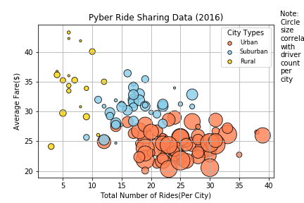
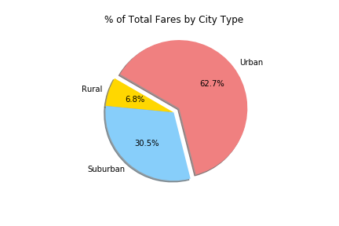
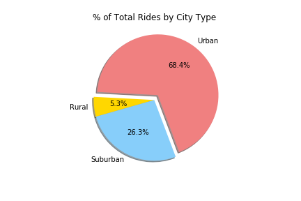
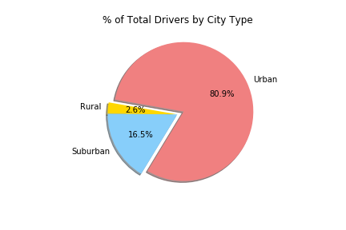

The ride sharing bonanza continues! Seeing the success of notable players like Uber and Lyft, you've decided to join a fledgling ride sharing company of your own. In your latest capacity, you'll be acting as Chief Data Strategist for the company. In this role, you'll be expected to offer data-backed guidance on new opportunities for market differentiation.
You've since been given access to the company's complete recordset of rides. This contains information about every active driver and historic ride, including details like city, driver count, individual fares, and city type.
Your objective is to build a Bubble Plot that showcases the relationship between four key variables:

- Average Fare ($) Per City
- Total Number of Rides Per City
- Total Number of Drivers Per City
- City Type (Urban, Suburban, Rural)

There seems to be more drivers in the urban area, but the average fares for each ride is less. I would suggest to current/future drivers for Pyber to concentrate in the suburban area because there are less drivers and the average fare is more competitive then driving in the urban area. 

In addition, you will be expected to produce the following three pie charts:

Base on the pie for % of total fares by city type, there are more riders for the Urban area, but their average fare per ride is $24.53. Even though there are less riders in the suburban area, the average fare is $30.97, which is $6.44 more than the average urban fare. 

Lastly, according to this Pyber pie chart, there are too many urban drivers, which mean more competition and the drivers earn less money. If you break down the numbers, there are 80.9% (2405 urban drivers), 68.4% (1625 urban rides – see table below) and the average fare is $24.53 even though there are more rides.

